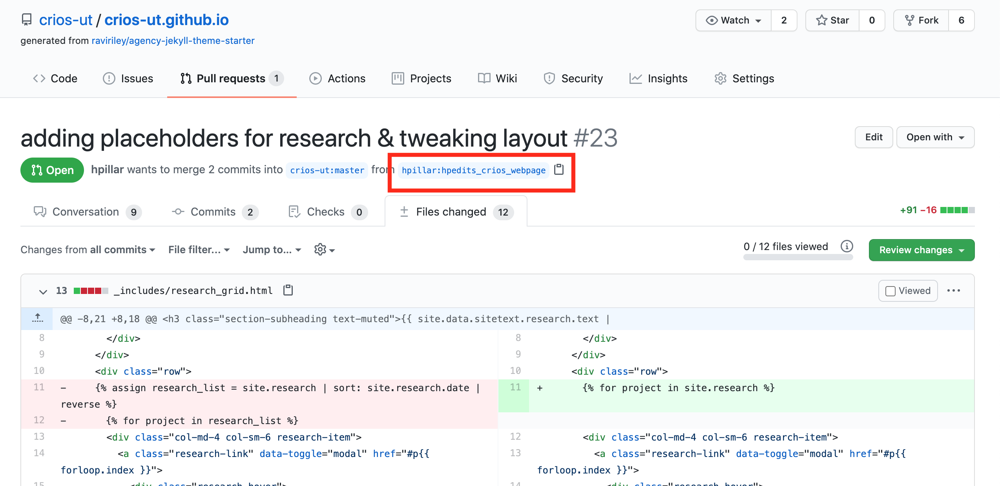
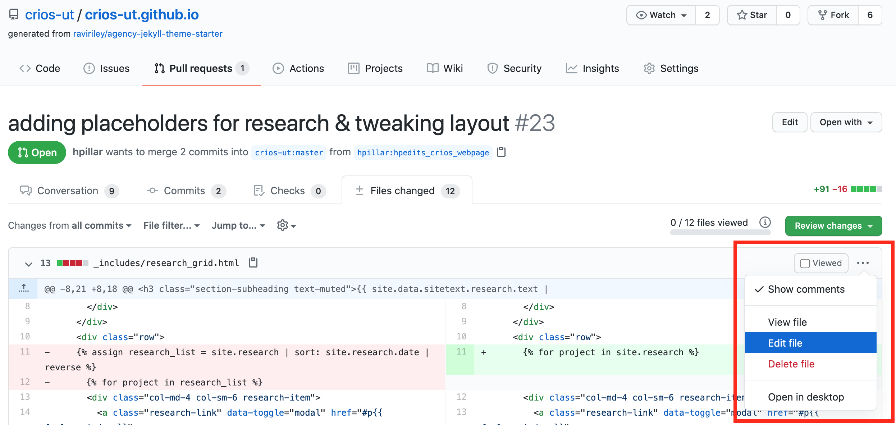
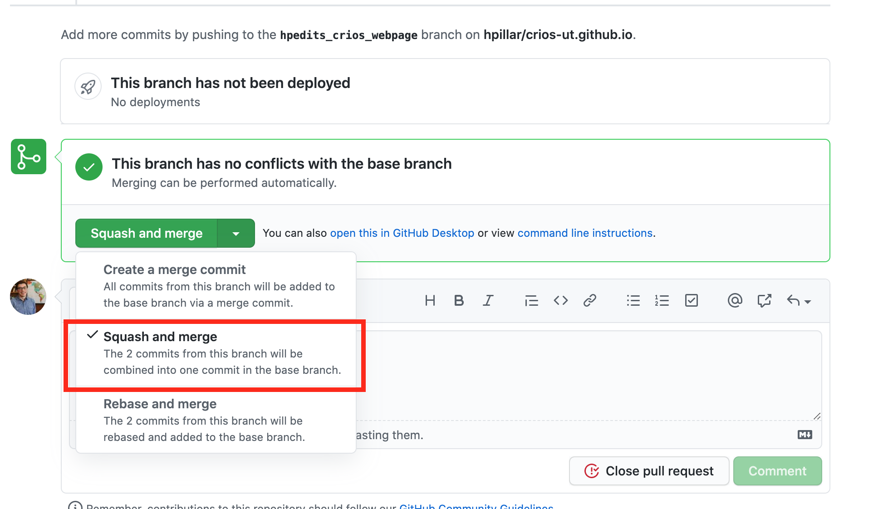

# CRIOS Website

The source code for the CRIOS group website.
This is based on the 
[Agency Jekyll Theme](https://github.com/raviriley/agency-jekyll-theme), 
created by [raviriley](https://github.com/raviriley).

## Adding to "About", "Group", or "Publications" sections

- Modify text in [\_data/sitetext.yml](https://github.com/crios-ut/crios-ut.github.io/blob/master/_data/sitetext.yml).
- Add images to [assets/img](https://github.com/crios-ut/crios-ut.github.io/tree/master/assets/img), and subfolders within

## Adding to "Research" or "Outreach" sections

- add a new file which describes the project, event, etc to the [\_outreach](https://github.com/crios-ut/crios-ut.github.io/tree/master/_outreach) or [\_research](https://github.com/crios-ut/crios-ut.github.io/tree/master/_research) sections
- the top portion, denoted by `---` above and below, specifies the content
    to show when this link is clicked on (title, subtitle, and main image).
    The corresponding content under "caption:", title, subtitle, and thumbnail 
    specify what the "link" looks like on the home page.
    
- text below this is rendered as kramdown markdown, see [here](https://kramdown.gettalong.org/quickref.html) for a syntax guide

## Instructions to build the website locally

0. Install bundler if you do not already have it

If you have root permissions

```
gem install bundler 
```

otherwise, install locally, e.g.

```
gem install bundler --install-dir=crios-ut.github.io/bundler
```

1. Configure bundle and install

```
cd crios-ut.github.io
bundle install --path vendor/bundle
```

Note that this install command raises a deprecation warning, but
I cannot find how to get bundle to work with a local app (i.e. this website)
using their suggested commands (which would be
`bundle config --local set path vendor/bundle`, but then it is unclear how to
get the install command to use this directory).

2. Serve it up 

After the above steps are done once, this is all that's necessary
to build the website locally.

```
bundle exec jekyll serve
```

This will tell you where the website is running, e.g.

```
Server address: http://127.0.0.1:4000
```

Navigate to this address in your browser to see the local version of the website.
(Tip: localhost is shorthand for 127.0.0.1, so this website is equivalent to 
http://localhost:4000)

## Tips for reviewing a pull request

1. Ensure your branch is caught up with the upstream branch,
    see e.g. [here](https://mitgcm.readthedocs.io/en/latest/contributing/contributing.html#using-git-and-github) for some MITgcm tips. 
    Note that some prefer to replace the command

    ```
    git pull upstream master
    ```

    with

    ```
    git pull --rebase upstream master
    ```

    see [here](https://www.atlassian.com/git/tutorials/merging-vs-rebasing) for a
    detailed description about the difference.

2. Check out the branch that the pull request is based on to test
    that it does not break the website.
    Again, more instructions at the bottom of
    [this page on the MITgcm documentation](https://mitgcm.readthedocs.io/en/latest/contributing/contributing.html#reviewing-pull-requests).
    A quick set of commands is:

    ```
    git remote add crios_teammate git@github.com:crios_teammate/crios-ut.github.io.git
    git fetch crios_teammate
    git checkout --track crios_teammate/their_dev_branch
    ```
    
    for the concrete example shown in the screenshot below, one would replace
    `crios_teammate` with `hpillar`, and `their_dev_branch` with
    `hpedits_crios_webpage`.

     <p align="center">
     
     </p>

3. Use the above instructions to locally build the website, make sure it looks good,
    links go where they should, images show up, and no errors show up in the 
    terminal window hosting the website (i.e. where you ran
    `bundle exec jekyll serve`) etc...

4. If files need to be fixed, either ask them to or modify them yourself,
    respectfully! ;) . It is easiest to modify files directly on the web browser.
    
    <p align="center">
      
    </p>

5. If everything looks good, go ahead and merge the PR. It seems cleanest to use the
    "Squash and Merge" option (see below), which squashes all of the commits
    associated with the PR into a single merge commit, which will now be added 
    to the master branch commit history. Note that closing the PR
    essentially removes it.

    <p align="center">
      
    </p>
